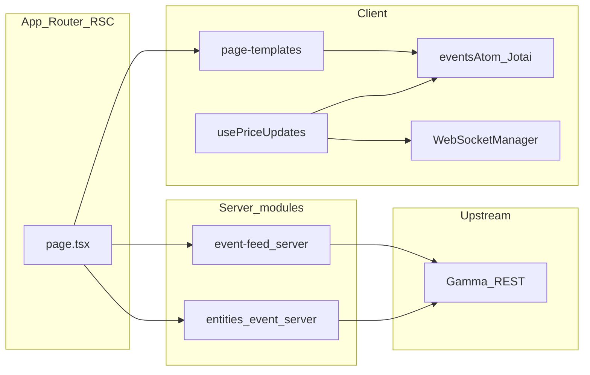

# plaee — Polymarket prediction markets UI

A client application built with **Next.js 16**, **React 19**, **Jotai**, and **Tailwind CSS 4**: an event feed backed by Polymarket’s Gamma API, tag filters, a crypto section, and **live price updates** over the CLOB WebSocket. The codebase follows **Feature-Sliced Design** under `src/`.

Contributor rules for layers and imports: [AGENTS.md](AGENTS.md).

## Tech stack

| Area | Stack |
|------|--------|
| Framework | Next.js 16 (App Router), React 19 |
| State | Jotai (`useHydrateAtoms` for SSR → client) |
| Styling | Tailwind CSS 4 |
| Validation / message typing | Zod, manual type guards in `src/shared/lib/websocket` |
| WebSocket outside the browser | `ws` package (see Setup) |

## Setup

### Requirements

- **Node.js** — an LTS release is enough for local UI development in the browser.
- Package manager: the repo includes **`package-lock.json`** — use **npm**.

Environment note: in [src/shared/lib/websocket/client/wsClientFactory.ts](src/shared/lib/websocket/client/wsClientFactory.ts), code running outside the browser uses the global built-in `WebSocket` on Node **≥ 22**, and the `ws` package on older Node versions. For a typical `next dev` session in the browser, `window.WebSocket` is used.

### Install and scripts

```bash
npm install
npm run dev    # Next.js dev server
npm run build  # production build
npm run start  # run after build
npm run lint   # ESLint
```

### Configuration and external URLs

- **No `.env` file is required** — the codebase does not use `process.env`; the REST base URL is a constant in [src/shared/api/config.ts](src/shared/api/config.ts): `https://gamma-api.polymarket.com`.
- WebSocket (client): market — `wss://ws-subscriptions-clob.polymarket.com/ws/market`, RTDS — `wss://ws-live-data.polymarket.com` (see [src/shared/lib/websocket/channels/market.ts](src/shared/lib/websocket/channels/market.ts), [src/shared/lib/websocket/channels/rtds.ts](src/shared/lib/websocket/channels/rtds.ts)).

## Architecture

### The `app/` directory (App Router)

- **[app/layout.tsx](app/layout.tsx)** — fonts, [app/globals.css](app/globals.css), [app/app-provider.tsx](app/app-provider.tsx) with the Jotai `Provider`, shared shell (`CategoryNav`, `TopProgressBar`).
- **Route pages (RSC)** load data through public `server` modules from features and entities, then render **page-templates**:
  - [app/page.tsx](app/page.tsx) — home;
  - [app/event/[slug]/page.tsx](app/event/[slug]/page.tsx) — event detail;
  - [app/crypto/page.tsx](app/crypto/page.tsx), [app/crypto/[subSlug]/page.tsx](app/crypto/[subSlug]/page.tsx) — crypto feed and sub-routes.
- Those routes use short **route revalidation** (`revalidate = 30`) so Server Components ship a recent snapshot for hydration while live prices continue over WebSocket. Rationale and where caching still applies are documented in [app/data-route-policy.ts](app/data-route-policy.ts): short ISR on page routes, request-scope memoization in server helpers, `unstable_cache` for small responses, and `Cache-Control` on `app/api/*`.
- **API proxies** under [app/api/](app/api/) — thin `GET` handlers (events, pagination, slug, markets, tags) calling upstream helpers from `src/entities/event/server` and related modules; responses include CORS and `Cache-Control` for the edge (e.g. [app/api/events/route.ts](app/api/events/route.ts)).

### The `src/` directory (FSD)

Layers (bottom to top by dependency direction):

| Layer | Role | Examples |
|-------|------|----------|
| **shared** | UI primitives, API config, WebSocket client, formatting | `src/shared/ui/*`, `src/shared/lib/websocket`, `src/shared/api` |
| **entities** | Domain types, atoms, selectors | `event`, `market`, `tag`, `category` |
| **features** | Application scenarios | `event-feed`, `event-filter`, `price-updates`, `tags-feed`, `crypto-feed`, `trade-cta`, … |
| **widgets** | Larger UI blocks | `event-card`, `events-filter`, `category-nav`, … |
| **page-templates** | Page composition, Jotai hydration | `home`, `event-detail`, `crypto` |

Slice public API: **`index.ts`** (client-safe surface) and, where needed, **`server.ts`** with `import "server-only"` — server loaders are not exported from the client entrypoint.

Cross-slice imports within the same layer are constrained by ESLint (`import/no-restricted-paths` in [eslint.config.mjs](eslint.config.mjs)); `shared` must not import `entities`, `features`, `widgets`, or `page-templates`.

### Data flow (SSR → state → realtime)



Client templates ([src/page-templates/home/HomePage.tsx](src/page-templates/home/HomePage.tsx), [src/page-templates/event-detail/EventDetailBootstrap.tsx](src/page-templates/event-detail/EventDetailBootstrap.tsx)) use `useHydrateAtoms` / `useEffect` to align `eventsAtom` with server data, then enable `usePriceUpdates` (see below).

## Realtime

### Transport

- A singleton **[WebSocketManager](src/shared/lib/websocket/manager.ts)** (`getWebSocketManager()`) with two channels — **Market** (CLOB) and **RTDS** (live data) — each built on **[WSClient](src/shared/lib/websocket/client/wsClient.ts)** with reconnect, heartbeat, and parsing of the raw stream into normalized messages.
- Connections to Polymarket are **client-only**; Server Components and route handlers do **not** keep a standing WebSocket for prices.

### Price orchestration in the UI

- The **[usePriceUpdates](src/features/price-updates/model/usePriceUpdates.ts)** hook:
  - reads `eventsAtom` and builds a map `clobTokenId` → `{ marketId, outcomeId }` from each market’s `clobTokenIds` / `outcomes`;
  - calls `manager.connect()`, subscribes to the global market message stream, and **per-asset** `subscribeAsset` / `unsubscribeAsset` when the token set changes (effect dependency: a stable string of sorted ids).
- Incoming messages are classified (price change, trade, best bid/ask, book, tick size, new market, resolved, etc.); a **display price** is derived from bid/ask or the book; Jotai atoms in **`@/src/entities/market`** are updated (`priceUpdatesAtom`, `wsConnectionStateAtom`, maps for tick size / resolved / new market).
- Components consume **`useOutcomePrice`**, **`usePriceUpdateFlash`**, and related selectors (e.g. [src/features/trade-cta/ui/TradeCtaPair.tsx](src/features/trade-cta/ui/TradeCtaPair.tsx), event cards).

The **RTDS** channel is wired in the manager for future scenarios; the main price UI path is the **market** channel plus `usePriceUpdates`.

## Limitations

- **Dependence on Polymarket** — public REST and WebSocket: rate limits, outages, and API/WS contract changes are outside this repo’s control.
- **Caching and payload size** — home, crypto, and event routes use **30 s** revalidation for the server snapshot, while request-scope memoization avoids duplicate work during a single render pass; tags use `unstable_cache` with **1 h** revalidation ([src/features/tags-feed/server.ts](src/features/tags-feed/server.ts)).
- **Not a trading venue** — the app displays prices and filters; “Buy” controls in the UI **do not** navigate to Polymarket or place orders ([TradeCtaPair](src/features/trade-cta/ui/TradeCtaPair.tsx) uses presentational `button` elements without navigation).
- **Home grid cap** — after filtering, at most **`HOME_VISIBLE_EVENT_CARDS`** cards (**33**, [src/page-templates/home/constants/index.ts](src/page-templates/home/constants/index.ts)) are rendered; additional filtered events are not shown in the grid.
- **WebSocket subscription scale** — concurrent `subscribeAsset` calls grow with outcomes for events present in `eventsAtom`; very large lists may stress the browser or hit upstream limits (a risk assessment, not a hard limit encoded in the app).
